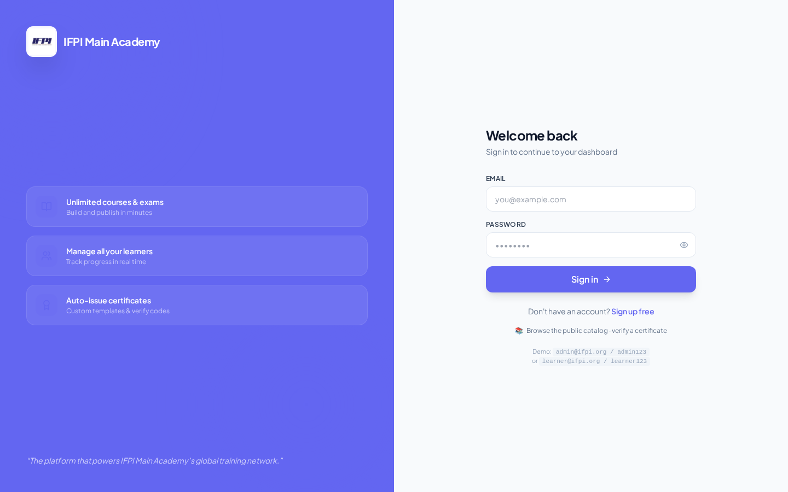

# IFPI Learning Academy — Staff Handbook

> **A friendly walk-through of IFPI Learning, written for the people who actually use it every day.**

**Who this is for:** Frances, the content team, instructors, learners — anyone who signs into IFPI to do work. If you're deploying the platform to a server, read the Setup Manual instead.

**How to read it:** Start with "Getting In." Everything else you can dip into when you need it. Every section has screenshots of the actual screens so you know what to look for.

---

## What's inside

1. [Getting In — logging in the first time](#2-getting-started)
2. [Your Dashboard — what everything means](#4-dashboards)
3. [Building a Course — manually or with AI](#5-authoring)
4. [The AI Authoring Suite — every generator explained](#6-ai-suite)
5. [What Learners See — the other side of the app](#7-learner)
6. [Certificates — issuing, sharing, revoking](#8-certificates)
7. [Reports and Analytics](#9-analytics)
8. [Sharing with Other Systems](#10-integrations)
9. [Your Account — profile, password, privacy](#account-self)
10. [Where to Find These Manuals in the App](#15-docs-library)

> *Technical appendix (§11–14) — reference material for developers and Platform Ops. Feel free to skip if you're not a coder.*

---

# 1. What IFPI Learning Is, In Two Paragraphs

IFPI Learning Academy is a place where your organisation runs its training. You build courses, invite learners, they watch videos and take quizzes, they earn certificates, you see reports of how they're doing. That's it in a sentence.

What makes IFPI unusual is the **AI Authoring Suite**. Instead of writing every slide by hand, you can hand IFPI a topic ("Introduction to Music Copyright") and it drafts the entire course for you — outline, slides, quiz questions, flashcards, even narration and a short video summary. You edit anything you don't like. What used to take a full week of a content designer's time now takes an afternoon.

| Webhooks, API Tokens | ADMIN+ |
| Reports, Leaderboard | ADMIN+ (all) / LEARNER (own) |
| Organization Settings | OWNER, SUPER_ADMIN |

---

# 2. Getting In — Your First Sign-In {#2-getting-started}

## 2.1 What you need

- A modern web browser (Chrome, Edge, Firefox or Safari from the last two years)
- Cookies enabled (they are by default — you'd know if they weren't)
- The web address, email, and password IFPI Platform Ops emailed you

## 2.2 The login screen

Type the web address into your browser (it looks like `https://your-academy.ifpi.example.com/login`). You'll see this:

Type your email in the top box, your password in the bottom box, and click **Sign in**.

## 2.3 If it's your first time — change the password

The first password IFPI gave you is temporary. As soon as you sign in, IFPI will show you a screen asking you to pick a new one.

- Type the temporary password in "Current password"
- Type a new password (at least 8 characters, different from the old one) in "New password"
- Type the same new password again in "Confirm new password"
- Click **Save new password**

You'll land on your dashboard. **Write down your new password somewhere safe** — IFPI can email you a reset link if you forget, but only if the email on your account is correct.

## 2.4 If you forget your password

On the login screen, click **"Forgot your password?"**. Type your email, hit send, check your inbox. There'll be a link that's good for 24 hours — click it, pick a new password, done.

If the email never arrives (check your spam folder first), contact whoever set up your IFPI account. They have a rescue tool.

## 2.5 Signing out

Click your name in the bottom-left corner, then **Sign out**. Always do this on a shared computer.

---

# 3. Who Can Do What (Roles) {#3-roles}

Everyone in IFPI has a **role**. Your role decides what you see when you sign in. There are five:

- **Admin** — you can do everything: invite people, build courses, publish them, issue certificates, see all the reports. This is what senior IFPI staff have.
- **Instructor** — you can build courses and grade learners. You can't invite new members or see billing.
- **Learner** — the most common role. You take courses, sit exams, earn certificates. You don't see any admin screens.
- **Billing Viewer** — read-only look at invoices and spend. For finance staff who don't build content.
- **Super Admin** — reserved for IFPI Platform Ops. Manages every academy on the platform.

People can hold more than one role if they need to (e.g. an instructor who also enrolls in colleagues' courses).

---

# 4. Your Dashboard — What Everything Means {#4-dashboards}

The dashboard is the first thing you see when you sign in. What appears there depends on your role.

## 4.1 What Admins see

Going around the screen:

- **Four numbers at the top** — Active Learners, Courses Published, Certificates Issued, and AI Spend This Month. These give you the health of your academy in one glance.
- **Onboarding progress** — a percentage showing how much of the initial setup you've completed. Click it to see the checklist.
- **Members needing action** — learners who've stalled: not signed in for 2 weeks, failed an exam, have a certificate about to expire, etc. Click any row to jump to that person.
- **Docs opened this week** — how many times your team has read the setup and user manuals (the ones you're reading right now). Handy for spotting who might need help.
- **Quick actions** — coloured shortcut tiles for common jobs: build a course, invite members, view reports, open the AI suite.

## 4.2 What Instructors see

Same shape as the admin dashboard, but with fewer tiles — no billing figures, no invite-members button. Focused on the courses you own and the learners taking them.

## 4.3 What Learners see

- **My Courses** — cards for every course you're enrolled in. Click one to pick up where you left off.
- **Streak counter** — how many days in a row you've been active. Great gamification.
- **Certificates** — your earned certificates, ready to download or share.
- **Flashcards due today** — quick-review deck powered by spaced repetition.

## 4.4 Watching your AI spend

If your academy uses the AI Authoring Suite, keep an eye on `Tokens & Spend` in the sidebar. It shows a rolling 14-day chart of how much AI content generation is costing you, against your monthly cap.

---

# 5. Building a Course {#5-authoring}

## 5.1 The two ways to build

Every course starts with clicking **New Course** from the Courses page.

From there you have two paths:

- **Build slide-by-slide, by hand** — the traditional way. Best when you already have all your material written and you just need to type it in.
- **Generate the whole thing with AI** — the fast way. Type a topic, IFPI drafts everything, you edit what needs editing. Best when you're starting from scratch.

Most content teams use a mix: AI generates a first draft, humans polish it.

## 5.2 Building a course by hand

Click **New Course**, fill in the title, description, category, and any prerequisites (see next section). Save.

You'll land on the course editor:

- **Left panel** — the list of slides. Click **+ Add slide** to create one.
- **Middle** — the content editor for the currently selected slide.
- **Right** — settings for this slide (type, ordering, whether it's required).

Slide types you can pick:
- **Text** — write in the box like it's a document. Supports headings, lists, bold, links.
- **Video** — paste a video URL (YouTube, Vimeo, or upload your own).
- **Image** — upload a graphic.
- **PDF** — upload a PDF document.
- **Audio** — for narration or podcasts.
- **SCORM** — upload a pre-built SCORM course package from another system.

Drag slides up and down to reorder. Save as you go.

## 5.3 Adding prerequisites

If Course B should only be available to learners who've finished Course A, add A as a prerequisite of B. Click **Prerequisites → Add**, pick the course, save.

You can chain many prerequisites together. IFPI will refuse to create a loop (A requires B, B requires A) — no headaches.

## 5.4 Letting people comment on slides

Under each slide, learners can leave comments — great for questions or clarifications. Instructors can reply, pin useful threads, and mute problem users. Turn comments off per slide if you want to.

## 5.5 Publishing

Once you're happy, flip the course status from **Draft** to **Published**. IFPI does a quick check first — you need at least one required slide, and if you set a passing score you need a passing exam. If anything's missing it tells you exactly what.

Published courses appear in the catalogue immediately. Learners can now enrol.

---

# 6. The AI Authoring Suite {#6-ai-suite}

This is where IFPI shines. Every tool here saves your content team hours of work. All of these are on the **Authoring** page.

## 6.1 Course Builder — draft a whole course in one shot

Type a topic in the box (e.g. "Introduction to Music Copyright Law for African Producers"), pick the target audience level and length, click **Generate**. IFPI does the rest:

1. Drafts an outline (usually 6-10 slides).
2. Writes each slide's content.
3. Writes a matching quiz with the answer key.
4. Suggests images for each slide.

You review the outline first — reject slides you don't want, tweak the ones you like. IFPI regenerates just those bits. Once you're happy, click **Save all** and the whole course appears in your Courses list, ready to edit or publish.

## 6.2 Deep Research — grounded in real sources

If you're teaching something factual (regulations, industry statistics), turn on **Deep Research**. IFPI's AI will search the live web while drafting, and every claim it makes gets a citation. Learners see the sources on the slide.

Requires a Tavily API key (see Setup Manual Phase D).

## 6.3 Flashcards — spaced repetition study

Click **Generate flashcards** on any published course. IFPI reads the slides and produces study cards (question on the front, answer on the back). Learners see these on their dashboard, sorted by which they most need to review — using the SM-2 algorithm, the one Anki uses.

## 6.4 Narration — text becomes voice

For any slide, click **Narrate**. IFPI reads the slide content aloud in a natural voice. Eight languages supported out of the box, and IFPI auto-detects which one to use based on the slide's text.

## 6.5 Visuals — AI-generated images

For any slide, click **Generate visual**. IFPI uses Google's Nano Banana model to produce an image that matches the slide's content. Refresh a few times if the first one isn't quite right.

Also used for certificate banners — see Setup Manual Phase A.

## 6.6 Video overview — Sora 2

Click **Generate video overview** on a course. IFPI produces a ~30-second promotional clip that summarises the course. Useful for your marketing pages or the course catalogue thumbnail. Takes 2-3 minutes to render — IFPI notifies you when it's done.

## 6.7 Mind maps

For any course, click **Mind map**. IFPI lays out every slide as a node in an interactive diagram — great for showing learners how the pieces connect. Drag nodes around; the layout saves automatically.

## 6.8 AI Tutor — Q&A for learners

Learners can click **Ask the tutor** on any slide. IFPI reads the whole course and answers their question, citing the specific slide the answer came from. Zero hallucinations.

## 6.9 Keeping AI costs under control

Every generation click costs a few cents. Your budget cap (Setup Manual Phase D) stops it running away. You'll see the live spend on the `Tokens & Spend` page, and IFPI emails all admins when you hit 80% of your monthly cap.

---

# 7. What Learners See {#7-learner}

Now flip perspective — this is what someone with the **Learner** role experiences.

## 7.1 Finding and enrolling in a course

From their dashboard, learners click **Browse courses**. They see every course you've published, filterable by category. Click a card → **Enrol**. If the course has prerequisites they haven't finished, IFPI politely blocks the enrol and tells them which course they need to complete first.

## 7.2 Taking a slide-by-slide course

Learners move through slides one at a time. Progress is saved automatically, so they can close their laptop and resume from the same slide next week. On each slide they can:

- **Ask the AI Tutor** a question about what they just read.
- **Leave a comment** (if you enabled it).
- **Play narration** if you generated it.

The progress bar at the top shows how far they are through the course.

## 7.3 Taking an exam

At the end of a course, if you set a passing score, learners take a summative exam. It can have multiple-choice, true/false, or short-answer questions. IFPI grades automatically (except short-answer, which comes to instructors for manual marking).

If they fail, they can retake (subject to the max-attempts limit you set). Every attempt is recorded.

## 7.4 Flashcards

If you generated flashcards, learners see a "Review flashcards" tile on their dashboard. It shows the cards they most need to review based on how well they remembered them last time (this is spaced repetition — the same technique Anki, Duolingo, and Quizlet use).

## 7.5 Earning a certificate

Once they've completed all required slides AND passed the exam (if there is one), the certificate is generated automatically. They can download it, share it to LinkedIn with one click, or send anyone a public verification link.

## 7.6 Motivation — streaks and badges

Learners see their **daily streak** on the dashboard (consecutive days active). They earn badges for milestones: finishing their first course, getting 100% on an exam, completing a learning path. Weekly digest emails recap what their cohort achieved and nudge them toward what's next.

---

# 8. Certificates, Verification & Sharing {#8-certificates}

# 8. Certificates {#8-certificates}

## 8.1 What's on the certificate

Every certificate IFPI issues shows:

- **Learner's name** — the person who earned it
- **Course title** — what they completed
- **Their cohort** — if they were in one (e.g. "Sales 2026 Q1")
- **Passing score** — the mark they achieved
- **Date issued** — when they earned it
- **Your academy's branding** — your logo, your colour, your signature
- **A unique 22-character code** — think of it as the certificate's fingerprint
- **A QR code and clickable link** — for instant verification

The PDF looks like this when downloaded:

## 8.2 How outsiders verify a certificate

If a recruiter, regulator, or client wants to check a certificate is genuine, they:

1. Scan the QR code with their phone, **or**
2. Type the 22-character code into your academy's `/verify` page

Either way, they see a simple confirmation showing who was awarded the certificate, for which course, and when. That's it — no other personal data is exposed.

## 8.3 Sharing to LinkedIn

Learners see a **"Add to LinkedIn"** button on every certificate they've earned. One click pre-fills the LinkedIn form with the certificate code, course title, and your academy name.

## 8.4 Revoking a certificate

Sometimes you need to invalidate a certificate — plagiarism found after the fact, accreditation issue, etc. **Revoke** does this without deleting anything.

From the **Certificates** page:
- **Revoke one** — click the certificate row, hit **Revoke**, type "REVOKE" to confirm, add a reason. Done. The certificate stays visible but marked "Revoked" and the PDF cannot be re-downloaded.
- **Revoke many at once** — tick the checkboxes on multiple rows, click **Bulk actions → Revoke selected**. Same confirmation.
- **Un-revoke** — if it was a mistake, click **Un-revoke** to bring it back.
- **Re-email download links** — for holders who lost their email.
- **Download a batch as ZIP** — bundle up to 100 certificate PDFs into a single ZIP file for archiving.

Every revoke, un-revoke, or bulk action is logged forever. Nothing is silent.

## 8.5 Monthly compliance report

If enabled, IFPI emails a monthly PDF summary of everything certificate-related to whoever you've listed — certificates issued, revoked, deletion requests, failed login attempts, top admin actions. Nothing to schedule. It just arrives.

---

# 9. Reports and Analytics {#9-analytics}

Under **Reports** in the sidebar, you get a set of pre-built dashboards. Everything can be exported as CSV or PDF.

- **Enrolment funnel** — how many people signed up, enrolled, completed, earned a certificate. Where you're losing them.
- **Course health** — for each course, which slide learners drop off at, average quiz scores, time spent per slide. Tells you which slides need work.
- **Cohort persistency** — 30, 60, 90-day retention. Are the November hires still active in February?
- **AI spend** — how much each AI provider is costing, spend per certificate issued.
- **Instructor workload** — how many courses each instructor owns, how much grading is pending.
- **Token usage** — if you have API tokens (Setup Manual Phase E), see what they're being used for.

---

# 10. Sharing with Other Systems {#10-integrations}

## 10.1 ERP360 SSO
See Setup Manual Phase E.1 for the technical setup — but for staff purposes, once it's enabled you just click through from ERP360 to IFPI and never sign in again.

## 10.2 Talking to IFPI from spreadsheets and scripts (API tokens)

If your team uses spreadsheets that pull IFPI data (e.g. "how many active learners this month?"), or if you want another system to create courses automatically, you'll need an **API token**. See Setup Manual Phase E.2.

Once you have a token, you can share it with your automations. Every call is logged, so if a token is misused you can see it and revoke it.

## 10.3 Getting notified when things happen (webhooks)

If you'd like Slack, Discord, or another system to be notified when a course is published, a certificate is issued, or an AI spend threshold is hit, use **webhooks**. Setup Manual Phase E.3 explains how to point them at your other tools.

## 10.4 Exporting courses to other systems (SCORM)

Selling training to another company? You can export any course as a SCORM package (industry standard). Their learning system will import it as-is. From any course → **Publish → SCORM → Download**.

## 10.5 Exporting a course as a slide deck (PPTX)

Every course can also be downloaded as a PowerPoint presentation — handy for offline presentations or handing content to another platform. Click **Export → PowerPoint** on the course page.

---

# Your Account — Profile, Password, Privacy {#account-self}

This section is for **every user**, whatever their role.

## What you can change

Click your name in the sidebar and pick **Profile**. From here:

- **Change your display name** — what appears on your certificates and comments.
- **Upload a profile photo** — appears next to your comments and on the leaderboard.
- **Change your password** — see below.
- **Turn on Two-Factor Authentication** — highly recommended. Uses Google Authenticator or any TOTP app. Setup Manual Phase B.4 explains.
- **Language** — pick your preferred language for the UI (independent of your academy's default).
- **Notifications** — decide which emails you want (weekly digest, cohort recap, streak nudges).

## Change your password

`Profile → Security → Change Password`. Type your current password, then your new one twice. Save. You stay signed in.

If you forgot the current one, sign out, then use the **Forgot password?** link on the sign-in screen.

## Download all your data (GDPR)

Under `Profile → Privacy → Download my data` you can download a ZIP file containing everything IFPI has about you: your profile, enrolments, progress, certificates, flashcard history, and audit trail. Perfect for GDPR "data portability" requests. Zero admin approval needed.

## Delete your account (GDPR Right to Erasure)

Under `Profile → Privacy → Delete my account`:

1. Click **Request deletion**. IFPI emails you a 6-digit code (valid for 10 minutes).
2. Type the code, click confirm.
3. Your personal details are wiped, your sessions and API tokens revoked, and your certificates continue to verify but show "IFPI Learner" instead of your name.

The deletion is permanent. Every step is logged.

## Verify your email

If your email address changes, IFPI will send a verification link to the new one. Until you click it, some sensitive actions are blocked. Look under `Profile → Security → Resend verification` if the email didn't arrive.

---

# 11. Rate Limits & Fair Use

To keep IFPI stable, some pages have gentle rate limits. Most staff never hit them:

- **Signing in** — 5 attempts per minute, 10 per hour on the same email.
- **New account signup** — 3 per hour from the same IP address.
- **Forgot-password requests** — 3 per hour per email address.
- **Email verification resends** — 2 per hour per user.
- **Public certificate verification** — 30 checks per minute per visitor.
- **Public catalogue browsing** — 60 pages per minute per visitor.

If a legitimate user ever hits a limit (unusual), they see a friendly "try again in a moment" message. Nothing else breaks.

---

# 12. Technical Reference

> *Everything below is for developers and Platform Ops. Non-technical staff can skip this — nothing here is required for daily use.*

## 12.1 Full permission matrix

Full permission keys live in `backend/core/role_registry.py`. Changes to permissions require both a code change AND a migration to backfill legacy users.

## 12.2 Data model overview {#12-data-model}

Core entities (see `backend/models/` for the full list):

- **Organization** — tenant boundary
- **User** — with roles + cohort
- **Course** → **CourseSlide** (ordered) → **SlideComment**
- **Exam** → **ExamQuestion** → **ExamAttempt**
- **Flashcard** → **FlashcardReview** (SM-2 state per learner)
- **Enrolment** + **CourseProgress**
- **Certificate** + verifier token + revocation events
- **AITokenCall** + **AIJob** + **AIUsageLedger**
- **APIToken** + **APITokenCall**
- **WebhookSubscription** + **WebhookDelivery**
- **AuditLog** (append-only, 3-year retention)
- **Invitation** (with cohort binding)
- **OutboxMessage** (email queue)
- **BadgeTier** + **UserBadge**
- **LiveSession** + **LiveSessionRsvp**
- **CourseView** + **SlideView** (funnel analytics)

## 12.3 Backend Router Inventory

<!-- AUTO:BEGIN router_index -->
| File | Lines |
|---|---|
| `routers/academies.py` | 109 |
| `routers/admin_analytics.py` | 322 |
| `routers/admin_entitlements.py` | 185 |
| `routers/admin_organizations.py` | 202 |
| `routers/affiliate.py` | 263 |
| `routers/ai.py` | 34 |
| `routers/ai_tutor.py` | 392 |
| `routers/api_tokens.py` | 284 |
| `routers/api_v2.py` | 68 |
| `routers/auth.py` | 487 |
| `routers/authoring.py` | 131 |
| `routers/authoring_extras.py` | 198 |
| `routers/authoring_media.py` | 284 |
| `routers/authoring_tutor.py` | 458 |
| `routers/badge_tiers.py` | 133 |
| `routers/billing.py` | 65 |
| `routers/campaign_links.py` | 256 |
| `routers/catalog.py` | 242 |
| `routers/certificates.py` | 960 |
| `routers/comments.py` | 84 |
| `routers/courses.py` | 950 |
| `routers/docs_library.py` | 103 |
| `routers/email_diagnostics.py` | 127 |
| `routers/enrollments.py` | 42 |
| `routers/erp360_sync.py` | 430 |
| `routers/exams.py` | 459 |
| `routers/feedback.py` | 106 |
| `routers/flashcards.py` | 497 |
| `routers/gamification.py` | 188 |
| `routers/imports.py` | 551 |
| `routers/invitations.py` | 206 |
| `routers/leads.py` | 140 |
| `routers/learning_paths.py` | 306 |
| `routers/live_sessions.py` | 851 |
| `routers/marketplace_analytics.py` | 430 |
| `routers/misc.py` | 1391 |
| `routers/narration.py` | 204 |
| `routers/notifications.py` | 48 |
| `routers/onboarding.py` | 97 |
| `routers/organization.py` | 467 |
| `routers/outbox.py` | 83 |
| `routers/owner_dashboard.py` | 226 |
| `routers/pathways.py` | 76 |
| `routers/portal.py` | 40 |
| `routers/public_catalog.py` | 201 |
| `routers/query_builder.py` | 250 |
| `routers/scheduled_reports.py` | 188 |
| `routers/scorm_xapi.py` | 512 |
| `routers/seo.py` | 369 |
| `routers/stripe_payments.py` | 303 |
| `routers/terms_kiosk.py` | 339 |
| `routers/totp.py` | 268 |
| `routers/uploads.py` | 134 |
| `routers/webhooks.py` | 253 |
| **Total** | **15992** |
<!-- AUTO:END router_index -->

## 12.2 Model Inventory

<!-- AUTO:BEGIN model_index -->
| Model | Table |
|---|---|
| `AIJob` | `ai_jobs` |
| `AITutorMessage` | `ai_tutor_messages` |
| `AITutorSession` | `ai_tutor_sessions` |
| `AIUsageLedger` | `ai_usage_ledger` |
| `AccountDeletionRequest` | `account_deletion_requests` |
| `AffiliateCode` | `affiliate_codes` |
| `AffiliateReferral` | `affiliate_referrals` |
| `ApiToken` | `api_tokens` |
| `ApiTokenCall` | `api_token_calls` |
| `AuditLog` | `audit_logs` |
| `BadgeTier` | `badge_tiers` |
| `BillingEvent` | `billing_events` |
| `CampaignLink` | `campaign_links` |
| `CampaignSignup` | `campaign_signups` |
| `Certificate` | `certificates` |
| `CertificateRevocationEvent` | `certificate_revocation_events` |
| `Course` | `courses` |
| `CoursePrerequisite` | `course_prerequisites` |
| `CourseRating` | `course_ratings` |
| `CourseSlide` | `course_slides` |
| `CourseView` | `course_views` |
| `CustomThemePreset` | `custom_theme_presets` |
| `EmailVerificationToken` | `email_verification_tokens` |
| `Enrollment` | `enrollments` |
| `Erp360SeenEvent` | `erp360_seen_events` |
| `Exam` | `exams` |
| `ExamAttempt` | `exam_attempts` |
| `ExamQuestion` | `exam_questions` |
| `FeatureFlag` | `feature_flags` |
| `Flashcard` | `flashcards` |
| `FlashcardReview` | `flashcard_reviews` |
| `ImportJob` | `import_jobs` |
| `Invitation` | `invitations` |
| `KioskSettings` | `kiosk_settings` |
| `LearningPath` | `learning_paths` |
| `LearningPathEnrollment` | `learning_path_enrollments` |
| `LearningPathItem` | `learning_path_items` |
| `LiveSession` | `live_sessions` |
| `LiveSessionRsvp` | `live_session_rsvps` |
| `Notification` | `notifications` |
| `Organization` | `organizations` |
| `OutboxMessage` | `outbox_messages` |
| `PasswordResetToken` | `password_reset_tokens` |
| `PaymentTransaction` | `payment_transactions` |
| `Person` | `persons` |
| `ProgressOutbox` | `progress_outbox` |
| `RefreshToken` | `refresh_tokens` |
| `ScheduledReport` | `scheduled_reports` |
| `ScormPackage` | `scorm_packages` |
| `SlideComment` | `slide_comments` |
| `SlideVersion` | `slide_versions` |
| `SlideView` | `slide_views` |
| `SourceChunk` | `source_chunks` |
| `SourceDocument` | `source_documents` |
| `SsoJtiSeen` | `sso_jti_seen` |
| `Subscription` | `subscriptions` |
| `TermsAcceptance` | `terms_acceptances` |
| `TermsVersion` | `terms_versions` |
| `TesterFeedback` | `tester_feedback` |
| `User` | `users` |
| `UserBadge` | `user_badges` |
| `UserRole` | `user_roles` |
| `WebhookDelivery` | `webhook_deliveries` |
| `WebhookSubscription` | `webhook_subscriptions` |
| `XApiStatement` | `xapi_statements` |

_Total: **65** ORM models._
<!-- AUTO:END model_index -->

---

# 13. API Reference (Selective) {#13-api}

Full OpenAPI at `/docs`. The full route table is regenerated automatically:

<!-- AUTO:BEGIN api_routes -->
| Endpoint | Verb | Purpose |
|---|---|---|
| `/api` | GET | Root |
| `/api/academies` | GET | List Academies |
| `/api/academies` | POST | Create Academy |
| `/api/admin/affiliate/codes` | GET | List Codes |
| `/api/admin/affiliate/codes` | POST | Create Code |
| `/api/admin/affiliate/codes/{code_id}` | PATCH | Update Code |
| `/api/admin/affiliate/earnings` | GET | Earnings |
| `/api/admin/affiliate/referrals` | GET | List Referrals |
| `/api/admin/affiliate/referrals/{referral_id}/mark-credited` | POST | Mark Credited |
| `/api/admin/analytics` | GET | Analytics |
| `/api/admin/analytics/enrollments-weekly` | GET | Enrollments Weekly |
| `/api/admin/api-tokens` | GET | List Tokens |
| `/api/admin/api-tokens` | POST | Create Token |
| `/api/admin/api-tokens/analytics/spend` | GET | Ai Spend Analytics |
| `/api/admin/api-tokens/analytics/usage` | GET | Token Usage Analytics |
| `/api/admin/api-tokens/{token_id}` | DELETE | Delete Token |
| `/api/admin/api-tokens/{token_id}/revoke` | POST | Revoke Token |
| `/api/admin/audit-digest` | GET | Audit Digest |
| `/api/admin/audit-log` | GET | List Audit |
| `/api/admin/campaign-links` | GET | List Campaign Links |
| `/api/admin/campaign-links` | POST | Create Campaign Link |
| `/api/admin/campaign-links/{link_id}` | DELETE | Delete Campaign Link |
| `/api/admin/campaign-links/{link_id}` | PATCH | Toggle Campaign Link |
| `/api/admin/campaign-links/{link_id}/attribution` | GET | Campaign Attribution |
| `/api/admin/campaign-links/{link_id}/qr` | GET | Campaign Qr |
| `/api/admin/cert-preview` | POST | Preview Cert |
| `/api/admin/cohorts` | GET | List Cohorts |
| `/api/admin/course-dropoff/{course_id}` | GET | Course Dropoff |
| `/api/admin/dashboard/docs-engagement` | GET | Docs Engagement |
| `/api/admin/dashboard/members-needing-action` | GET | Members Needing Action |
| `/api/admin/docs` | GET | List Docs |
| `/api/admin/docs/{slug}/pdf` | GET | Download Pdf |
| `/api/admin/docs/{slug}/raw` | GET | Download Raw |
| `/api/admin/email/send-test` | POST | Send Test Email |
| `/api/admin/email/transport-status` | GET | Transport Status |
| `/api/admin/entitlements/user/{user_id}` | GET | List User Entitlements |
| `/api/admin/entitlements/user/{user_id}/course/{course_id}` | GET | Get Single Entitlement |
| `/api/admin/feature-flags/{flag_key}` | PUT | Set Feature Flag |
| `/api/admin/feedback` | GET | List Feedback |
| `/api/admin/feedback/{feedback_id}/status` | POST | Set Feedback Status |
| `/api/admin/imports` | GET | List Jobs |
| `/api/admin/imports/run` | POST | Run Import |
| `/api/admin/imports/upload-zip` | POST | Upload Zip And Run |
| `/api/admin/imports/{job_id}` | GET | Get Job |
| `/api/admin/imports/{job_id}/retry` | POST | Retry Import |
| `/api/admin/imports/{job_id}/rollback` | POST | Rollback Import |
| `/api/admin/invitations` | GET | List Invitations |
| `/api/admin/invitations` | POST | Create Invitation |
| `/api/admin/invitations/bulk` | POST | Bulk Invite |
| `/api/admin/invitations/{invitation_id}` | DELETE | Revoke Invitation |
| `/api/admin/kiosk/settings` | PUT | Update Kiosk Settings |
| `/api/admin/leaderboard.csv` | GET | Leaderboard Csv |
| `/api/admin/marketplace-funnel` | GET | Marketplace Funnel Rollup |
| `/api/admin/marketplace-funnel/{course_id}` | GET | Marketplace Funnel |
| `/api/admin/onboarding/checklist` | GET | Onboarding Checklist |
| `/api/admin/organizations` | GET | List Organizations |
| `/api/admin/organizations/{org_id}/integrations/erp360` | GET | Get Erp360 Integration |
| `/api/admin/organizations/{org_id}/integrations/erp360` | PATCH | Patch Erp360 Integration |
| `/api/admin/outbox` | GET | List Outbox |
| `/api/admin/outbox/stats` | GET | Outbox Stats |
| `/api/admin/outbox/{message_id}/retry` | POST | Retry Outbox |
| `/api/admin/query-builder/build` | POST | Build Query |
| `/api/admin/reports/cohort-stats` | GET | Cohort Stats |
| `/api/admin/scheduled-reports` | GET | List Scheduled |
| `/api/admin/scheduled-reports` | POST | Create Scheduled |
| `/api/admin/scheduled-reports/{report_id}` | DELETE | Delete Scheduled |
| `/api/admin/scheduled-reports/{report_id}` | PUT | Update Scheduled |
| `/api/admin/scheduled-reports/{report_id}/run-now` | POST | Run Now |
| `/api/admin/scorm` | GET | List Scorm Packages |
| `/api/admin/scorm/upload` | POST | Upload Scorm |
| `/api/admin/storage/info` | GET | Storage Info |
| `/api/admin/terms` | GET | List Terms |
| `/api/admin/terms` | POST | Publish Terms |
| `/api/admin/terms/acceptances` | GET | List Acceptances |
| `/api/admin/users` | GET | List Users |
| `/api/admin/users/{user_id}/2fa/disable` | POST | Admin Disable |
| `/api/admin/webhooks` | GET | List Subscriptions |
| `/api/admin/webhooks` | POST | Create Subscription |
| `/api/admin/webhooks/deliveries` | GET | List All Deliveries |
| `/api/admin/webhooks/{sub_id}` | DELETE | Delete Subscription |
| `/api/admin/webhooks/{sub_id}` | PUT | Update Subscription |
| `/api/admin/webhooks/{sub_id}/deliveries` | GET | List Deliveries |
| `/api/admin/webhooks/{sub_id}/test` | POST | Test Subscription |
| `/api/affiliate/lookup/{code}` | GET | Lookup |
| `/api/ai/course-builder` | POST | Ai Course Builder |
| `/api/auth/2fa/challenge` | POST | Challenge |
| `/api/auth/2fa/disable` | POST | Disable |
| `/api/auth/2fa/setup` | POST | Setup |
| `/api/auth/2fa/setup-init` | POST | Setup Init |
| `/api/auth/2fa/status` | GET | Totp Status |
| `/api/auth/_test/reset-rate-limit` | POST | Test Reset Rate Limit |
| `/api/auth/change-password` | POST | Change Password |
| `/api/auth/forgot-password` | POST | Forgot Password |
| `/api/auth/login` | POST | Login |
| `/api/auth/logout` | POST | Logout |
| `/api/auth/me` | DELETE | Confirm Account Deletion |
| `/api/auth/me` | GET | Me |
| `/api/auth/me/delete-request` | POST | Request Account Deletion |
| `/api/auth/me/export` | GET | Export My Data |
| `/api/auth/refresh` | POST | Refresh |
| `/api/auth/register` | POST | Register |
| `/api/auth/resend-verification` | POST | Resend Verification |
| `/api/auth/reset-password` | POST | Reset Password |
| `/api/auth/sso-exchange` | POST | Sso Exchange |
| `/api/auth/sso-status` | GET | Sso Status |
| `/api/auth/verify-email` | POST | Verify Email |
| `/api/authoring/budget` | GET | Get Budget |
| `/api/authoring/budget` | PUT | Update Budget |
| `/api/authoring/flashcards/bulk-save` | POST | Bulk Save Flashcards |
| `/api/authoring/flashcards/by-course/{course_id}` | GET | List By Course |
| `/api/authoring/flashcards/generate` | POST | Generate Flashcards |
| `/api/authoring/flashcards/{card_id}` | DELETE | Delete Card |
| `/api/authoring/flashcards/{card_id}` | PATCH | Update Card |
| `/api/authoring/mindmap/{course_id}` | POST | Generate Mindmap |
| `/api/authoring/mindmap/{course_id}/layout` | DELETE | Clear Mindmap Layout |
| `/api/authoring/mindmap/{course_id}/layout` | GET | Load Mindmap Layout |
| `/api/authoring/mindmap/{course_id}/layout` | PUT | Save Mindmap Layout |
| `/api/authoring/narration/generate` | POST | Generate Narration |
| `/api/authoring/narration/languages` | GET | Narration Languages |
| `/api/authoring/narration/{slide_id}` | DELETE | Clear Narration |
| `/api/authoring/pptx/{course_id}` | GET | Export Course Pptx |
| `/api/authoring/redaction/preview` | POST | Redaction Preview |
| `/api/authoring/research` | GET | List Research Jobs |
| `/api/authoring/research/start` | POST | Research Start |
| `/api/authoring/research/{job_id}` | GET | Research Status |
| `/api/authoring/sources` | GET | List Sources |
| `/api/authoring/sources` | POST | Upload Source |
| `/api/authoring/sources/search` | POST | Semantic Search |
| `/api/authoring/sources/{doc_id}` | DELETE | Delete Source |
| `/api/authoring/status` | GET | Authoring Status |
| `/api/authoring/tutor/ask` | POST | Tutor Ask |
| `/api/authoring/video/generate` | POST | Start Video Generation |
| `/api/authoring/video/history` | GET | Video History |
| `/api/authoring/video/preview` | POST | Video Cost Preview |
| `/api/authoring/video/{job_id}` | GET | Video Status |
| `/api/authoring/visuals/generate` | POST | Generate Visual |
| `/api/badge-tiers` | GET | List Tiers |
| `/api/badge-tiers` | POST | Create Tier |
| `/api/badge-tiers/reorder` | PATCH | Reorder Tiers |
| `/api/badge-tiers/{tier_id}` | DELETE | Delete Tier |
| `/api/badge-tiers/{tier_id}` | PATCH | Update Tier |
| `/api/billing/subscribe` | POST | Subscribe |
| `/api/billing/subscriptions` | GET | My Subscriptions |
| `/api/billing/webhook` | POST | Billing Webhook |
| `/api/branding/public` | GET | Public Branding |
| `/api/catalog` | GET | Catalog |
| `/api/catalog/organizations` | GET | Catalog Organizations |
| `/api/catalog/{course_id}` | GET | Catalog Detail |
| `/api/catalog/{course_id}/reviews` | GET | Catalog Reviews |
| `/api/catalog/{course_id}/slides/{slide_id}/track-view` | POST | Track Slide View |
| `/api/catalog/{course_id}/track-view` | POST | Track View |
| `/api/certificates` | GET | My Certificates |
| `/api/certificates/admin-export.csv` | GET | Admin Export Certificates Csv |
| `/api/certificates/admin-list` | GET | Admin List Certificates |
| `/api/certificates/bulk-email` | POST | Bulk Email Certificates |
| `/api/certificates/bulk-revoke` | POST | Bulk Revoke Certificates |
| `/api/certificates/bulk-unrevoke` | POST | Bulk Unrevoke Certificates |
| `/api/certificates/bulk-zip` | POST | Bulk Zip Certificates |
| `/api/certificates/transcript` | GET | My Transcript |
| `/api/certificates/transcript.json` | GET | My Transcript Json |
| `/api/certificates/verify/{code}` | GET | Verify Certificate |
| `/api/certificates/verify/{code}/og-image.png` | GET | Certificate Og Image Png |
| `/api/certificates/verify/{code}/og-image.svg` | GET | Certificate Og Image |
| `/api/certificates/{cert_id}/pdf` | GET | Download Certificate Pdf |
| `/api/certificates/{cert_id}/revocation-history` | GET | Cert Revocation History |
| `/api/certificates/{cert_id}/revoke` | POST | Revoke Certificate |
| `/api/certificates/{cert_id}/unrevoke` | POST | Unrevoke Certificate |
| `/api/courses` | GET | List Courses |
| `/api/courses` | POST | Create Course |
| `/api/courses/reorder` | PATCH | Reorder Catalog |
| `/api/courses/{course_id}` | DELETE | Delete Course |
| `/api/courses/{course_id}` | GET | Get Course |
| `/api/courses/{course_id}` | PATCH | Update Course |
| `/api/courses/{course_id}/archive` | POST | Archive Course |
| `/api/courses/{course_id}/complete` | POST | Complete Course |
| `/api/courses/{course_id}/duplicate` | POST | Duplicate Course |
| `/api/courses/{course_id}/enroll` | POST | Enroll |
| `/api/courses/{course_id}/prerequisites` | GET | List Prerequisites |
| `/api/courses/{course_id}/prerequisites/{prereq_course_id}` | DELETE | Remove Prerequisite |
| `/api/courses/{course_id}/prerequisites/{prereq_course_id}` | POST | Add Prerequisite |
| `/api/courses/{course_id}/progress` | POST | Save Slide Progress |
| `/api/courses/{course_id}/publish` | POST | Publish Course |
| `/api/courses/{course_id}/rating` | GET | Get Course Rating |
| `/api/courses/{course_id}/rating` | POST | Rate Course |
| `/api/courses/{course_id}/reviews` | GET | List Course Reviews |
| `/api/courses/{course_id}/reviews/{rating_id}/reply` | POST | Reply To Review |
| `/api/courses/{course_id}/reviews/{rating_id}/toggle-hidden` | POST | Toggle Review Hidden |
| `/api/courses/{course_id}/slides` | POST | Add Slide |
| `/api/courses/{course_id}/slides/reorder` | PATCH | Reorder Slides Early |
| `/api/courses/{course_id}/slides/{slide_id}` | DELETE | Delete Slide |
| `/api/courses/{course_id}/slides/{slide_id}` | PATCH | Update Slide |
| `/api/courses/{course_id}/slides/{slide_id}/versions` | GET | List Slide Versions |
| `/api/courses/{course_id}/slides/{slide_id}/versions/{version_number}` | GET | Get Slide Version |
| `/api/courses/{course_id}/slides/{slide_id}/versions/{version_number}/restore` | POST | Restore Slide Version |
| `/api/courses/{course_id}/toggle-featured` | POST | Toggle Featured |
| `/api/courses/{course_id}/unarchive` | POST | Unarchive Course |
| `/api/courses/{course_id}/unpublish` | POST | Unpublish Course |
| `/api/enrollments` | GET | My Enrollments |
| `/api/erp360/sync/status` | GET | Erp360 Sync Status |
| `/api/erp360/sync/test-ping` | POST | Erp360 Sync Test Ping |
| `/api/erp360/webhooks/user` | POST | Erp360 Webhook User |
| `/api/exams` | GET | List Exams |
| `/api/exams` | POST | Create Exam |
| `/api/exams/ai-generate-questions` | POST | Ai Generate Questions |
| `/api/exams/{exam_id}` | DELETE | Delete Exam |
| `/api/exams/{exam_id}` | GET | Get Exam |
| `/api/exams/{exam_id}` | PATCH | Update Exam |
| `/api/exams/{exam_id}/attempts` | GET | List Exam Attempts |
| `/api/exams/{exam_id}/attempts` | POST | Submit Attempt |
| `/api/exams/{exam_id}/attempts/reset` | POST | Reset Exam Attempts |
| `/api/exams/{exam_id}/question-insights` | GET | Exam Question Insights |
| `/api/exams/{exam_id}/question-insights.csv` | GET | Exam Question Insights Csv |
| `/api/exams/{exam_id}/questions` | PUT | Replace Questions |
| `/api/exams/{exam_id}/questions/{question_id}` | PATCH | Update Question |
| `/api/feature-flags` | GET | Get Feature Flags |
| `/api/feedback` | POST | Submit Feedback |
| `/api/feedback/screenshot` | POST | Upload Feedback Screenshot |
| `/api/gamification/leaderboard` | GET | Leaderboard |
| `/api/gamification/learning-streak` | GET | Learning Streak |
| `/api/gamification/me` | GET | My Gamification |
| `/api/gamification/preferences` | GET | Get Gamification Preferences |
| `/api/gamification/preferences` | PATCH | Update Gamification Preferences |
| `/api/gamification/streak-leaderboard` | GET | Streak Leaderboard |
| `/api/health` | GET | Health |
| `/api/invitations/{token}` | GET | Lookup Invitation |
| `/api/invitations/{token}/accept` | POST | Accept Invitation |
| `/api/join/{slug}` | GET | Lookup Campaign |
| `/api/join/{slug}/signup` | POST | Campaign Signup |
| `/api/kiosk/settings` | GET | Get Kiosk Settings |
| `/api/kiosk/unlock` | POST | Kiosk Unlock |
| `/api/leads` | POST | Capture Lead |
| `/api/leads/embed.js` | GET | Embed Widget |
| `/api/learn/flashcards/courses/{course_id}/due` | GET | Due Flashcards |
| `/api/learn/flashcards/courses/{course_id}/stats` | GET | Flashcard Stats |
| `/api/learn/flashcards/streak` | GET | Flashcard Streak |
| `/api/learn/flashcards/{card_id}/review` | POST | Review Flashcard |
| `/api/learning-paths` | GET | List Paths |
| `/api/learning-paths` | POST | Create Path |
| `/api/learning-paths/{path_id}` | DELETE | Delete Path |
| `/api/learning-paths/{path_id}` | GET | Get Path |
| `/api/learning-paths/{path_id}` | PATCH | Update Path |
| `/api/learning-paths/{path_id}/enroll` | POST | Enroll In Path |
| `/api/learning-paths/{path_id}/items` | POST | Add Item |
| `/api/learning-paths/{path_id}/items/reorder` | PATCH | Reorder Path Items |
| `/api/learning-paths/{path_id}/items/{course_id}` | DELETE | Remove Item |
| `/api/learning-paths/{path_id}/publish` | POST | Publish Path |
| `/api/live-sessions` | GET | List Sessions |
| `/api/live-sessions` | POST | Create Session |
| `/api/live-sessions/subscribe-url` | POST | Create Subscription Url |
| `/api/live-sessions/subscribe-url/qr` | GET | Subscribe Url Qr |
| `/api/live-sessions/subscribe-url/rotate` | POST | Rotate Subscription Secret |
| `/api/live-sessions/subscribe/{token}.ics` | GET | Subscribe Ics |
| `/api/live-sessions/upcoming` | GET | List Upcoming For Learner |
| `/api/live-sessions/{session_id}` | DELETE | Delete Session |
| `/api/live-sessions/{session_id}` | GET | Get Session |
| `/api/live-sessions/{session_id}` | PATCH | Update Session |
| `/api/live-sessions/{session_id}/cancel` | POST | Cancel Occurrence |
| `/api/live-sessions/{session_id}/ics` | GET | Download Ics |
| `/api/live-sessions/{session_id}/mark-attendance` | POST | Mark Attendance |
| `/api/live-sessions/{session_id}/rsvp` | POST | Toggle Rsvp |
| `/api/live-sessions/{session_id}/uncancel` | POST | Uncancel Occurrence |
| `/api/notifications` | GET | List Notifications |
| `/api/notifications/read-all` | PATCH | Mark All Read |
| `/api/organization` | GET | Get Org |
| `/api/organization` | PATCH | Update Org |
| `/api/organization/apply-theme/{slug}` | POST | Apply Theme Preset |
| `/api/organization/cohort-digest/send-now` | POST | Send Cohort Digest Now |
| `/api/organization/cohort-settings` | PUT | Update Cohort Settings |
| `/api/organization/cohort-settings/test-webhook` | POST | Test Cohort Webhook |
| `/api/organization/nurture-settings` | PUT | Update Nurture Settings |
| `/api/organization/nurture-settings/run-now` | POST | Run Nurture Now |
| `/api/organization/smtp` | GET | Get Smtp Config |
| `/api/organization/smtp` | PUT | Update Smtp Config |
| `/api/organization/smtp/test` | POST | Test Smtp Send |
| `/api/organization/themes` | GET | List Theme Presets |
| `/api/organization/themes` | POST | Create Custom Theme |
| `/api/organization/themes/{preset_id}` | DELETE | Delete Custom Theme |
| `/api/organization/themes/{preset_id}` | PUT | Update Custom Theme |
| `/api/pathways/admin/completions` | GET | Get Admin Completions |
| `/api/pathways/admin/completions.csv` | GET | Export Admin Completions Csv |
| `/api/pathways/admin/rpl` | POST | Post Grant Rpl |
| `/api/pathways/admin/rpl/{user_id}/{course_id}` | DELETE | Delete Rpl |
| `/api/pathways/map` | GET | Get Pathway Map |
| `/api/payments/v1/checkout/session` | POST | Create Checkout Session |
| `/api/payments/v1/checkout/status/{session_id}` | GET | Get Checkout Status |
| `/api/portal/{slug}` | GET | Get Portal |
| `/api/public/catalog` | GET | Public Catalog |
| `/api/public/certificates/verify/{code}` | GET | Verify Certificate |
| `/api/public/guides/{filename}` | GET | Download User Guide |
| `/api/rich-text/sanitize` | POST | Sanitize Html Payload |
| `/api/scorm/files/{package_id}/{rel_path}` | GET | Serve Scorm File |
| `/api/scorm/runtime.js` | GET | Scorm Runtime Shim |
| `/api/seo/certificates/share/{code}` | GET | Cert Share |
| `/api/seo/courses/share/{course_id}` | GET | Course Share |
| `/api/seo/robots.txt` | GET | Robots Txt |
| `/api/seo/sitemap-{org_id}.xml` | GET | Sitemap Org |
| `/api/seo/sitemap.xml` | GET | Sitemap Root |
| `/api/slides/{slide_id}/comments` | GET | List Comments |
| `/api/slides/{slide_id}/comments` | POST | Add Comment |
| `/api/slides/{slide_id}/comments/{comment_id}` | DELETE | Delete Comment |
| `/api/terms/accept` | POST | Accept Terms |
| `/api/terms/current` | GET | Get Current Terms |
| `/api/tutor/ask` | POST | Ask |
| `/api/tutor/save-as-flashcard` | POST | Save As Flashcard |
| `/api/tutor/sessions` | GET | List Sessions |
| `/api/tutor/sessions/{session_id}` | GET | Get Session |
| `/api/tutor/sessions/{session_id}/archive` | POST | Archive Session |
| `/api/uploads/bulk-media` | POST | Upload Bulk Media |
| `/api/uploads/cover-library` | GET | Cover Library |
| `/api/uploads/files/{path}` | GET | Serve Upload |
| `/api/uploads/image` | POST | Upload Image |
| `/api/uploads/media` | POST | Upload Media |
| `/api/v2/catalog` | GET | Public course catalog (enveloped) |
| `/api/v2/courses` | GET | List courses visible to the caller |
| `/api/v2/courses/{course_id}` | GET | Course detail with slides |
| `/api/v2/enrollments` | GET | Caller's enrollments with progress |
| `/api/v2/health` | GET | Service health (enveloped) |
| `/api/webhook/stripe` | POST | Stripe Webhook |
| `/api/xapi/statements` | GET | List Statements |
| `/api/xapi/statements` | POST | Receive Statement |

_Total: **320** registered API endpoints._
<!-- AUTO:END api_routes -->

Highlights (curated):

| Endpoint | Verb | Purpose |
|---|---|---|
| `/api/auth/login` | POST | Password login → JWT |
| `/api/auth/sso-status` | GET | SSO enabled? |
| `/api/auth/sso-exchange` | POST | ERP360 token → IFPI token |
| `/api/courses` | GET/POST | List/create |
| `/api/courses/{id}/enroll` | POST | Enrol current user |
| `/api/authoring/course/generate` | POST | AI course builder |
| `/api/authoring/video/generate` | POST | Sora 2 (async) |
| `/api/authoring/narration/generate` | POST | Multi-lang TTS |
| `/api/authoring/mindmap/{id}/layout` | PUT | Persist layout + thumbnail |
| `/api/learn/flashcards/courses/{id}/review` | POST | SM-2 grade |
| `/api/public/catalog` | GET | Anonymous (with `read:catalog` API token) |
| `/api/public/certificates/verify/{code}` | GET | Anonymous, rate-limited via Redis |
| `/api/certificates/{id}/pdf` | GET | Download cert PDF |
| `/api/admin/api-tokens/analytics/spend` | GET | AI spend chart data |
| `/api/webhooks` | GET/POST | Manage subscriptions |
| `/api/scorm/runtime.js` | GET | SCORM runtime shim |
| `/api/health` | GET | Liveness probe |

---

# 14. Security & Observability {#14-security}

**Shipped in Iterations 32–33.** All items below apply automatically to every tenant — no per-org config needed.

## 14.1 Security headers
Injected on every response by `core/middleware.py::SecurityHeadersMiddleware`:

- `Content-Security-Policy` — locked to self + integrated third-parties (Sentry, Tavily)
- `Strict-Transport-Security` — 1-year max-age, includeSubDomains
- `X-Content-Type-Options: nosniff`
- `Referrer-Policy: strict-origin-when-cross-origin`
- `Permissions-Policy` — minimal surface (no camera, no microphone, no geolocation unless explicitly required by a feature)

## 14.2 Rate limiting

| Route | Window | Max | Per |
|---|---|---|---|
| Login | 1 min | 5 | email |
| Login | 1 hour | 10 | email |
| Signup | 1 hour | 3 | IP |
| Forgot password | 1 hour | 3 | email |
| Verify-email resend | 1 hour | 2 | user |
| Certificate verify | 1 min | 30 | IP |
| Public catalogue | 1 min | 60 | IP |

All implemented via Redis-backed `slowapi.Limiter` in `backend/server.py`.

## 14.3 Audit logging

Every mutation (POST / PUT / PATCH / DELETE) is logged to `audit_logs` with:
- actor user_id + role
- route + method
- request body (PII redacted)
- timestamp
- 3-year retention

Admins can query via `/api/admin/audit-log` or request an LLM-generated digest at `/api/admin/audit-digest`.

## 14.4 Error handling

Unhandled exceptions are caught by `core/middleware.py::CatchAllExceptionsMiddleware`:
- 500s → Sentry notification + generic "Something went wrong" JSON (no stack trace in production)
- 422s → Pydantic validation detail (safe fields only)
- 401/403 → Consistent `{ detail: "..." }` shape

## 14.5 Frontend CSP & security

`frontend/public/_headers` (deployed by Netlify / Vercel / Nginx):
- `X-Frame-Options: DENY`
- `X-Content-Type-Options: nosniff`
- `Referrer-Policy: strict-origin-when-cross-origin`

React build also strips `console.log` in production via `drop_console: true` in `vite.config.ts`.

---

# 15. Where to Find These Manuals in the App {#15-docs-library}

Every IFPI deployment ships the manuals as markdown inside `/app/docs/`. They are also rendered as HTML at `frontend/public/docs/IFPI_Master_Manual.html` (auto-generated by `build_docs.py --html`).

Admins can open the in-app docs viewer from the sidebar: **Docs Library**. Learners and instructors see a read-only version.

If you're reading this on GitHub, the source lives at `docs/IFPI_USER_MANUAL.md` (this file) and `docs/IFPI_SETUP_MANUAL.md`.
