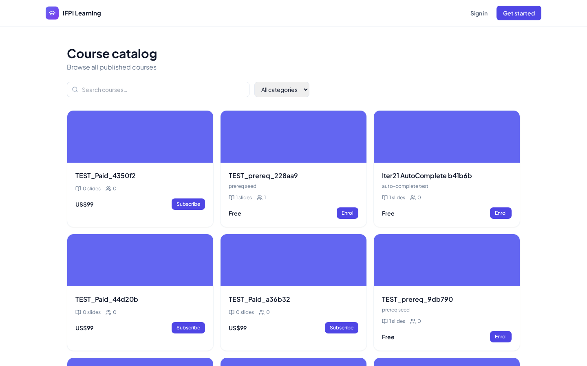
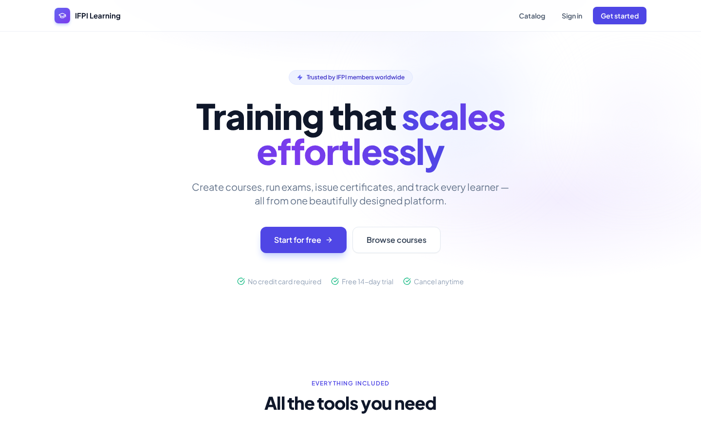
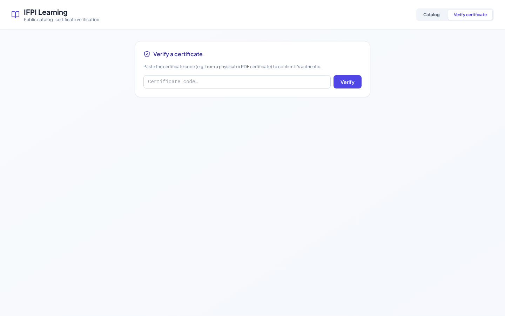

# IFPI Screen Inventory

*Auto-generated by `backend/scripts/build_screenshots.py`. Do not hand-edit.*

### ✅ 01. `login` — Login page — the first thing users see
- **Path:** `/login` (role: `anon`)
- **File:** `01_login.png`

### ✅ 02. `catalog_public` — Anonymous public catalog
- **Path:** `/catalog` (role: `anon`)
- **File:** `02_catalog_public.png`

### ✅ 03. `dashboard_admin` — Admin dashboard — org KPIs
- **Path:** `/dashboard` (role: `admin`)
- **File:** `03_dashboard_admin.png`

### ✅ 04. `courses_list_admin` — Course listing (admin)
- **Path:** `/dashboard/courses` (role: `admin`)
- **File:** `04_courses_list_admin.png`

### ✅ 05. `course_edit` — Course edit — slides + prerequisites
- **Path:** `/dashboard/courses/1` (role: `admin`)
- **File:** `05_course_edit.png`

### ✅ 06. `authoring_course_builder` — AI Course Builder — prompt to outline
- **Path:** `/dashboard/authoring` (role: `admin`)
- **File:** `06_authoring_course_builder.png`

### ✅ 07. `authoring_flashcards` — Flashcards authoring — AI generated
- **Path:** `/dashboard/authoring/flashcards/1` (role: `admin`)
- **File:** `07_authoring_flashcards.png`

### ✅ 08. `mindmap` — Mind map (reactflow) — savable layout
- **Path:** `/dashboard/courses/1/mindmap` (role: `admin`)
- **File:** `08_mindmap.png`

### ✅ 09. `research` — Deep Research (Tavily-grounded)
- **Path:** `/dashboard/authoring/research` (role: `admin`)
- **File:** `09_research.png`

### ✅ 10. `tokens` — AI spend chart + API token analytics
- **Path:** `/dashboard/tokens` (role: `admin`)
- **File:** `10_tokens.png`

### ✅ 11. `api_tokens` — API tokens — scoped credentials
- **Path:** `/dashboard/api-tokens` (role: `admin`)
- **File:** `11_api_tokens.png`

### ✅ 12. `webhooks` — Outgoing webhooks + delivery log
- **Path:** `/dashboard/webhooks` (role: `admin`)
- **File:** `12_webhooks.png`

### ✅ 13. `users` — Users + roles
- **Path:** `/dashboard/users` (role: `admin`)
- **File:** `13_users.png`

### ✅ 14. `academies` — Academies (sub-tenants inside an org)
- **Path:** `/dashboard/academies` (role: `admin`)
- **File:** `14_academies.png`

### ✅ 15. `badge_tiers` — Badge tiers + XP thresholds
- **Path:** `/dashboard/badges` (role: `admin`)
- **File:** `15_badge_tiers.png`

### ✅ 16. `leaderboard_admin` — Leaderboard (admin view)
- **Path:** `/dashboard/leaderboard` (role: `admin`)
- **File:** `16_leaderboard_admin.png`

### ✅ 17. `reports` — Reports — enrolment, cohort, spend
- **Path:** `/dashboard/reports` (role: `admin`)
- **File:** `17_reports.png`

### ✅ 18. `org_settings` — Organization settings + branding
- **Path:** `/dashboard/organization/settings` (role: `admin`)
- **File:** `18_org_settings.png`

### ✅ 19. `audit_log` — Audit log (append-only)
- **Path:** `/dashboard/audit` (role: `admin`)
- **File:** `19_audit_log.png`

### ✅ 20. `learner_dashboard` — Learner dashboard — in-progress + due
- **Path:** `/dashboard` (role: `learner`)
- **File:** `20_learner_dashboard.png`

### ✅ 21. `learner_course` — Slide viewer + narration player
- **Path:** `/learn/courses/1` (role: `learner`)
- **File:** `21_learner_course.png`

### ✅ 22. `learner_flashcards` — SM-2 swipeable flashcards
- **Path:** `/learn/flashcards/1` (role: `learner`)
- **File:** `22_learner_flashcards.png`

### ✅ 23. `learner_certificates` — Certificate wall + LinkedIn share
- **Path:** `/dashboard/certificates` (role: `learner`)
- **File:** `23_learner_certificates.png`

### ✅ 24. `verify_public` — Anonymous cert verify (rate-limited)
- **Path:** `/verify` (role: `anon`)
- **File:** `24_verify_public.png`

